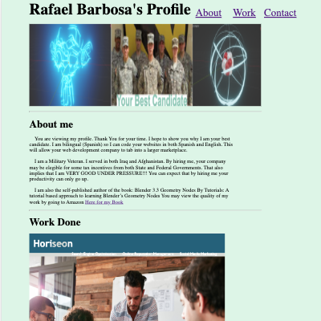

# BarbosaRPortfolio
This repository contains the code for the Module2 Challenge. It is written as if it were to be read by a "REAL EMPLOYEER". Some of the text was written as self-marketing, in order to entice this "REAL EMPLOYEER" to hire me.

## Description
This repository provides the code for the Github Pages site for evaluation of future employeers. It is meant to showcase the talents/Skills and potential of one Rafael Barbosa. Please view thru Github Pages.

Github Repository: [BarbosaRPortfolio](https://github.com/rbarbosa51/BarbosaRPortfolio)

Github Pages: 

## Screen Shots
600px Resolution

800px Resolution

1000px Resolution

## Table of Contents

- [Installation](#installation)
- [Usage](#usage)
- [Credits](#credits)
- [License](#license)
- [ThoughtProcess](#thought-process)
- [StudentNotes](#notes)

## Installation

It is meant to be viewed from Github Pages. No installation requirements.

## Usage
Click on any of the work images to go to either a site or a github pages app.

## Credits

Rafael Barbosa

## License

MIT License

----

## Notes:
Please see the comments inside the HTML/CSS files for further explanations. 

